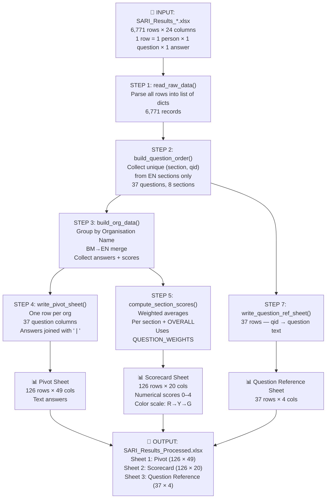
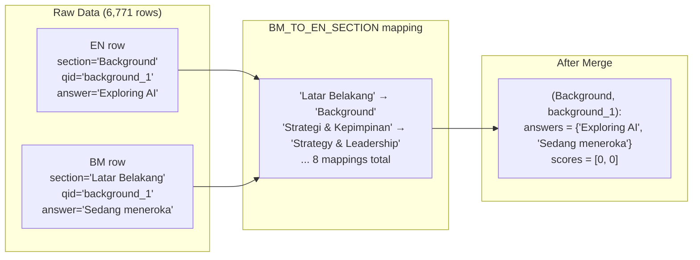
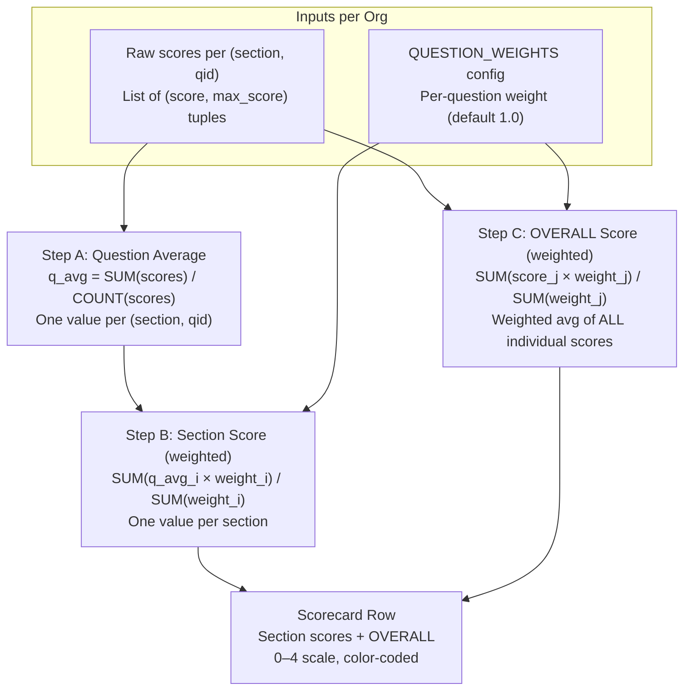
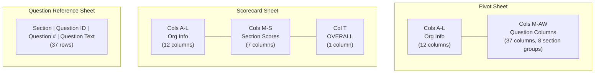
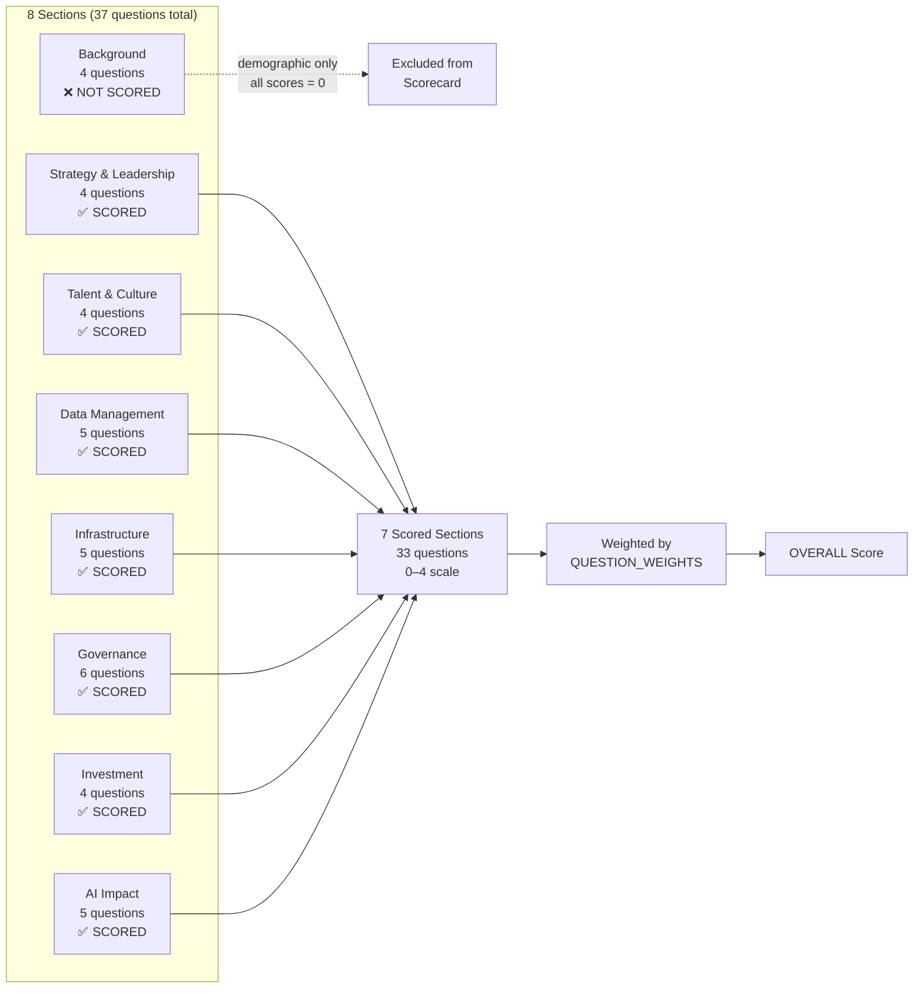

# Super Filter — Full Algorithm Documentation

## Overview

This document describes every step the `super_filter.py` script performs, from reading the raw Excel file to producing the final output. It covers data sources, transformations, formulas, and edge cases.

---

## 1. Input Data

**Source:** `SARI_Results_2026-08-05-01-54-15.xlsx` (or any SARI survey export)

**Sheet:** `Answers`

**Structure:** 6,771 rows × 24 columns

| Col | Field | Example |
|-----|-------|---------|
| 1 | Respondent ID | `d43c5240-...` |
| 2 | Submitted at | `Aug 5 · 09:13 AM` |
| 3 | Section | `Background` or `Latar Belakang` |
| 4 | Question # | `1` |
| 5 | Question ID | `background_1` |
| 6 | Question | `What is your organisation's current AI adoption stage?` |
| 7 | Answer | `Deployed AI in selected areas` |
| 8 | Answer value | `opt-4` |
| 9 | Answer score | `0` (for background) or `1`–`4` (for scored questions) |
| 10 | Max score | `None` (background) or `4` (scored) |
| 11 | Participant name | `RAPHAEL ANAK PETER SAMAT` |
| 12 | Email | `raphael@bdcswak.com` |
| 13 | Job title | `PROJECT ENGINEER` |
| 14 | Organisation name | `Borneo Development Corporation (Sarawak) Sdn Bhd` |
| 15 | Organisation type | `Government-Linked Company (GLC)` |
| 16 | Organisation size | `1–50` |
| 17 | Stakeholder category | `Government-linked Companies (GLCs)` |
| 18 | PCDS sector | `Construction` |
| 19 | District | `Kuching` |
| 20 | Role level | `Specialist / Expert` |
| 21 | Department | `PROJECT` |
| 22 | Age band | `35–44` |
| 23 | Part of group | `No` |
| 24 | Parent company | `None` |

**Key facts:**
- 126 unique organisations
- 183 unique participants (179 EN, 4 BM)
- 16 sections (8 English + 8 Bahasa Malaysia)
- 37 unique `question_id` values (same qid appears in both EN and BM sections)
- 33 scored questions (score 0–4), 4 demographic questions (background, all score=0)

---

## 2. Step-by-Step Processing

### Step 1: Read Raw Data

```
Function: read_raw_data(filepath)
Location: super_filter.py line 133
```

Reads every row from the Excel file (skipping the header row). Each row is converted to a dictionary using `RAW_COL_MAP` (column index → field name). All values are converted to strings and stripped of whitespace.

**Output:** `list[dict]` — 6,771 records, each with 24 fields.

---

### Step 2: Build Question Order

```
Function: build_question_order(rows)
Location: super_filter.py line 150
```

Scans all rows and collects unique `(section, question_id)` pairs. **Only English sections** are collected (BM sections are merged later in Step 3).

For each unique pair, records:
- `section` — e.g. `"Strategy & Leadership"`
- `question_id` — e.g. `"strategy_1"`
- `question_num` — e.g. `1`
- `question_text` — e.g. `"Which best describes your organisation's written plan..."`

Questions are sorted by:
1. Section order (as defined in `SECTION_ORDER` config)
2. Question number within the section

**Output:** `list[tuple]` — 37 ordered questions across 8 sections.

**Section order:**
```
1. Background                    (4 questions — demographic, not scored)
2. Strategy & Leadership         (4 questions)
3. Talent & Organisational Culture (4 questions)
4. Data Management & Readiness   (5 questions)
5. Infrastructure & Technology   (5 questions)
6. Governance, Policy & Ethics   (6 questions)
7. Investment                    (4 questions)
8. AI Implementation & Potential Impact (5 questions)
```

---

### Step 3: Group by Organisation (with BM→EN merge)

```
Function: build_org_data(rows)
Location: super_filter.py line 181
```

This is the core transformation. For each row:

#### 3a. Determine the organisation
```
org = row["organisation_name"]
```
If empty, skip the row.

#### 3b. Collect single-value fields
For these fields, take the **first value encountered** (all rows for the same org should have the same value):
- `organisation_name`, `parent_company`, `organisation_type`
- `organisation_size`, `stakeholder_category`, `pcds_sector`
- `district`, `part_of_group`

#### 3c. Collect multi-value (list) fields
For these fields, collect **all unique values** across all participants in the org:
- `role_level`, `department`, `age_band`, `job_title`

#### 3d. BM→EN Section Merge
```
en_sec = BM_TO_EN_SECTION.get(sec, sec)
```

If the row's section is a BM section (e.g. `"Latar Belakang"`), it is mapped to its English counterpart (e.g. `"Background"`). The mapping:

| BM Section | → | EN Section |
|---|---|---|
| Latar Belakang | → | Background |
| Strategi & Kepimpinan | → | Strategy & Leadership |
| Bakat & Budaya Organisasi | → | Talent & Organisational Culture |
| Pengurusan Data & Kesiapsiagaan | → | Data Management & Readiness |
| Infrastruktur & Teknologi | → | Infrastructure & Technology |
| Tadbir Urus, Dasar & Etika | → | Governance, Policy & Ethics |
| Pelaburan | → | Investment |
| Pelaksanaan AI & Impak | → | AI Implementation & Potential Impact |

The `question_id` is the same in both languages (e.g. `background_1` exists in both "Background" and "Latar Belakang"). After merging, answers and scores from both languages are combined under the English section.

#### 3e. Collect answers
```
o["answers"][(en_sec, qid)].add(content)
```
Stores unique answer texts per `(section, question_id)`. Uses a `set` so duplicate answers from multiple participants are deduplicated.

#### 3f. Collect scores
```
o["scores"][(en_sec, qid)].append((score, max_score))
```
Stores ALL individual scores per `(section, question_id)` as a list of `(score, max_score)` tuples. Unlike answers, scores are NOT deduplicated — every participant's score is kept for averaging.

**Output:** `dict[org_name]` → `{single, list, answers, scores}` for 126 organisations.

---

### Step 4: Build Pivot Sheet

```
Function: write_pivot_sheet(wb, orgs, questions)
Location: super_filter.py line 298
```

Creates the "Pivot" sheet in the output Excel.

**Layout:**
- **Row 1:** Section group headers (merged cells spanning question columns)
- **Row 2:** Column headers (org-level field names + question IDs)
- **Rows 3–128:** One row per organisation (126 rows)

**Column structure:**
```
Col A–L:  Org-level fields (12 columns)
Col M–AW: Question columns (37 columns, grouped by 8 sections)
```

**Cell content for question columns:**
```
All unique answers joined with " | "
Example: "Deployed AI in selected areas | Exploring / learning about AI | Sedang meneroka / mempelajari tentang AI"
```

**Cell content for list columns (Role Level, Department, etc.):**
```
Numbered list format:
1. Assistant
2. Manager / Team Lead
3. Specialist / Expert
```

---

### Step 5: Compute Scores (with Weightage)

```
Function: compute_section_scores(orgs, questions)
Location: super_filter.py line 441
```

This is where the performance scoring happens.

#### 5a. Question-level average

For each `(section, question_id)`, if an org has N participants who answered:

```
q_avg = SUM(score_1, score_2, ..., score_N) / N
```

Each score is 0–4 (from the raw data's `answer_score` column).

#### 5b. Section score (weighted)

```
Section Score = SUM(q_avg_i × weight_i) / SUM(weight_i)
```

Where:
- `q_avg_i` = average score for question `i` in this section
- `weight_i` = weight from `QUESTION_WEIGHTS` config (default 1.0)

Example — Strategy & Leadership section with 4 questions, all weight=1.0:
```
Section Score = (q_avg_strategy_1 × 1.0 + q_avg_strategy_2 × 1.0 +
                 q_avg_strategy_3 × 1.0 + q_avg_strategy_4 × 1.0) / 4.0
```

If a question has weight=2.0, it counts twice as much:
```
Section Score = (q_avg_q1 × 1.0 + q_avg_q2 × 2.0 + q_avg_q3 × 1.0 + q_avg_q4 × 1.0) / 5.0
```

#### 5c. OVERALL score (weighted)

```
OVERALL = SUM(score_j × weight_j) / SUM(weight_j)
```

Where:
- `score_j` = each individual participant's score (not question average)
- `weight_j` = weight of the question that score belongs to

This means the OVERALL is a **weighted average of all individual participant scores** across all 7 scored sections. If a question has weight=2.0, every participant's score for that question counts double.

#### 5d. Sections excluded from scoring

`Background` section is excluded because all 4 background questions have `answer_score = 0` in the raw data (they are demographic/classification questions, not performance questions).

**Output:** `dict[org_name]` → `{section_scores, overall_score}`

---

### Step 6: Build Scorecard Sheet

```
Function: write_scorecard_sheet(wb, orgs, questions)
Location: super_filter.py line 483
```

Creates the "Scorecard" sheet.

**Layout:**
- **Row 1:** Column headers (org fields + 7 section names + OVERALL)
- **Rows 2–127:** One row per organisation

**Color scale:** Red (low) → Yellow (mid) → Green (high) applied to all score columns.

---

### Step 7: Build Question Reference Sheet

```
Function: write_question_ref_sheet(wb, questions)
Location: super_filter.py line 564
```

A lookup table mapping `question_id` → full question text.

| Section | Question ID | Question # | Question Text |
|---|---|---|---|
| Background | background_1 | 1 | What is your organisation's current AI adoption stage? |
| ... | ... | ... | ... |

---

### Step 8: Save Output

```
Function: main()
Location: super_filter.py line 582
```

Saves the workbook to `SARI_Results_Processed.xlsx` with 3 sheets.

---

## 3. Complete Formula Reference

### 3.1 Question Average (raw 0–4)

```
q_avg(org, section, qid) = SUM(scores) / COUNT(scores)
```

Where `scores` = all individual participant scores for that org + section + question_id.

### 3.2 Section Score (raw 0–4, weighted)

```
section_raw(org, section) = SUM(q_avg_i × w_i) / SUM(w_i)
```

Where:
- `i` iterates over all questions in the section
- `w_i` = `QUESTION_WEIGHTS[qid]` (default 1.0)

### 3.3 Section Index (0–100)

```
section_index = (section_raw / 4.0) × 100
```

### 3.4 OVERALL Raw Score (0–4, weighted)

```
overall_raw(org) = SUM(score_j × w_j) / SUM(w_j)
```

Where:
- `j` iterates over ALL individual participant scores across all 7 scored sections
- `w_j` = weight of the question that score belongs to

### 3.5 AI Readiness Index (0–100)

```
AI Readiness Index = (overall_raw / 4.0) × 100
```

### 3.6 Readiness Level

```
Level = {
    Leading     if index ≥ 75
    Advancing   if index ≥ 50
    Developing  if index ≥ 25
    Nascent     if index < 25
}
```

| Index Range | Level | Description |
|---|---|---|
| 75–100 | **Leading** | AI is embedded in strategy and operations |
| 50–74 | **Advancing** | Active AI adoption with growing maturity |
| 25–49 | **Developing** | Early-stage AI exploration |
| 0–24 | **Nascent** | Minimal or no AI activity |

### 3.4 Weightage Config

```python
QUESTION_WEIGHTS = {
    "strategy_1": 1.0,   # default — equal weight
    "strategy_2": 2.0,   # double weight — this question matters more
    "aiapp_1": 0.0,      # zero weight — exclude this question entirely
    ...
}
```

---

## 4. Data Flow Diagram

### 4.1 High-Level Pipeline



### 4.2 BM→EN Merge Detail



### 4.3 Scoring Pipeline (per organisation)



### 4.4 Output Excel Structure



### 4.5 Section → Question Mapping



---

## 5. Edge Cases Handled

| Case | How it's handled |
|---|---|
| **Empty organisation name** | Row is skipped |
| **BM section with same qid as EN** | Merged into EN section via `BM_TO_EN_SECTION` |
| **Multiple participants, same answer** | Deduplicated in Pivot (set), all kept in Scorecard (list) |
| **Missing score** | Skipped (not counted in average) |
| **Background questions (score=0)** | Excluded from Scorecard entirely |
| **Org with no participants for a section** | Section score = `None` (shown as empty in Excel) |
| **Question with weight=0** | Excluded from both section and overall calculation |
| **Single participant org** | Works the same — q_avg = that one score |

---

## 6. Configuration Reference

All configurable values are at the top of `super_filter.py`:

| Config | Purpose | Default |
|---|---|---|
| `INPUT_FILE` | Source Excel path | `SARI_Results_*.xlsx` |
| `OUTPUT_FILE` | Output Excel path | `SARI_Results_Processed.xlsx` |
| `QUESTION_CELL_CONTENT` | What to show in Pivot cells | `"answer"` |
| `OUTPUT_COLUMNS` | Which org columns to include | All 12 |
| `SECTION_ORDER` | Left-to-right order of sections | 8 EN sections |
| `BM_TO_EN_SECTION` | BM→EN mapping | 8 mappings |
| `SCORECARD_SECTIONS` | Which sections to score | 7 (excludes Background) |
| `QUESTION_WEIGHTS` | Per-question weight (0–10) | All 1.0 |
