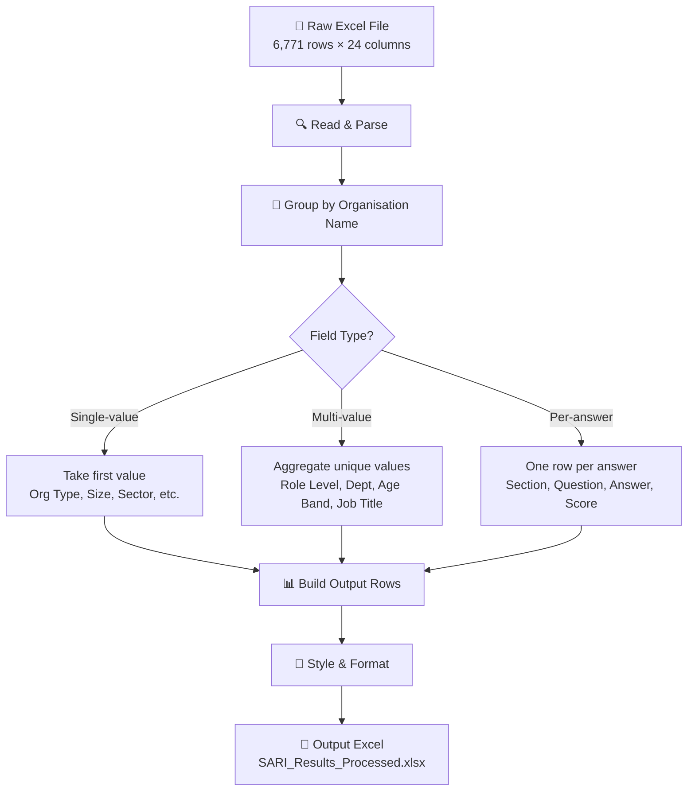

# Super Filter — SARI Survey Results Processor

A Python script that reads the raw SARI survey Excel export and produces a clean, grouped output where each row represents one **organisation × section × question × answer**.

## Setup & Run

### First time (on any laptop)

```bash
# 1. Create virtual environment
python3 -m venv venv

# 2. Activate it
source venv/bin/activate        # macOS / Linux
# venv\Scripts\activate         # Windows

# 3. Install dependencies
pip install -r requirements.txt

# 4. Run the script
python super_filter.py
```

### Subsequent runs

```bash
source venv/bin/activate        # activate the venv
python super_filter.py          # run
```

The output file `SARI_Results_Processed.xlsx` will appear in the same folder.

## How to Verify & Validate the Output

After running the script, open `SARI_Results_Processed.xlsx` and check these things:

### 1. Row count
The output should have the **same number of data rows** as the input (6,771 rows). This confirms no data was lost.

### 2. Org-level fields are consistent
Pick any organisation — scroll down its rows. Columns like **Organisation Type**, **Organisation Size**, **PDCS Sector**, **District** should be **identical** on every row for that org. If you see two different values for the same org, something is wrong.

### 3. Multi-value fields are aggregated
Columns like **Role Level**, **Department**, **Age Band**, **Job Title** should show all unique values joined with ` | `. For example, if an org has 5 participants with different job titles, you should see all 5 titles in one cell separated by ` | `.

### 4. Multi-participant answers are preserved
When multiple people from the same org answer the same question differently, **each unique answer gets its own row**. For example, if 5 people from "Borneo Development Corporation" answered `background_1` with 5 different answers, you should see 5 rows for that org + question — one per unique answer.

### 5. Column exclusion works
Open `super_filter.py`, comment out any line in the `OUTPUT_COLUMNS` list (add `#` at the start), re-run, and verify that column is gone from the output.

### 6. Quick sanity check (Python one-liner)
```bash
source venv/bin/activate
python3 -c "
import openpyxl
wb = openpyxl.load_workbook('SARI_Results_Processed.xlsx')
ws = wb.active
print('Headers:', [c.value for c in ws[1]])
print('Data rows:', ws.max_row - 1)
# Check org-level consistency
orgs = {}
for r in range(2, ws.max_row + 1):
    name = ws.cell(r, 1).value
    otype = ws.cell(r, 3).value
    if name not in orgs:
        orgs[name] = otype
    elif orgs[name] != otype:
        print(f'INCONSISTENT: {name} has both {orgs[name]} and {otype}')
print(f'Checked {len(orgs)} orgs for type consistency')
"
```

## How It Works



### Column Processing Logic

| Aggregator | Behaviour | Example Columns |
|---|---|---|
| `single` | One value per org (all rows should match) | Organisation Type, Size, Sector, District |
| `list` | All unique values joined with `\|` | Role Level, Department, Age Band, Job Title |
| `per_answer` | One row per unique answer | Section, Question ID, Question, Answer, Answer Score |

### Multi-Participant Handling

When multiple people from the same organisation answer the same question differently, **each unique answer gets its own row**. This means you'll see the same org + section + question repeated with different answers — this is intentional so you can see the spread of responses.

## Configuration

Open `super_filter.py` and edit the **CONFIG** section at the top:

```python
# Change input/output file names
INPUT_FILE = "SARI_Results_2026-08-05-01-54-15.xlsx"
OUTPUT_FILE = "SARI_Results_Processed.xlsx"

# To EXCLUDE a column, comment it out with #
OUTPUT_COLUMNS = [
    ("Organisation Name",     "organisation_name",   "single"),
    # ("Parent Company",      "parent_company",      "single"),  # ← excluded!
    ("Organisation Type",     "organisation_type",   "single"),
    ...
]
```

## Output Columns (Default)

| # | Column | Type |
|---|---|---|
| 1 | Organisation Name | Single |
| 2 | Parent Company | Single |
| 3 | Organisation Type | Single |
| 4 | Organisation Size | Single |
| 5 | Stakeholder Category | Single |
| 6 | PDCS Sector | Single |
| 7 | District | Single |
| 8 | Part of Group | Single |
| 9 | Role Level | List (aggregated) |
| 10 | Department | List (aggregated) |
| 11 | Age Band | List (aggregated) |
| 12 | Job Title | List (aggregated) |
| 13 | Section | Per-answer |
| 14 | Question ID | Per-answer |
| 15 | Question | Per-answer |
| 16 | Answer | Per-answer |
| 17 | Answer Value | Per-answer |
| 18 | Answer Score | Per-answer |

## Data Summary

- **126** unique organisations
- **16** sections (8 English + 8 Bahasa Malaysia)
- **74** unique questions
- **6,771** raw rows → **6,771** output rows
- **1–17** participants per organisation

## Requirements

- Python 3.8+
- openpyxl (`pip install openpyxl`)

## Project Structure

```
ammar_super_filter/
├── super_filter.py                          # Main processing script
├── requirements.txt                         # Python dependencies (pinned versions)
├── README.md                                # This file
├── Super_Filter.md                          # Original design brief
├── .gitignore                               # Ignore venv, cache, output files
├── venv/                                    # Virtual environment (not in git)
├── SARI_Results_2026-08-05-01-54-15.xlsx    # Input file (raw survey export)
└── SARI_Results_Processed.xlsx              # Output file (generated, not in git)
```

## Future Roadmap

- [ ] GUI application with drag-and-drop Excel upload
- [ ] Interactive column toggling and filtering
- [ ] Pivot table / chart generation
- [ ] Export to PDF report
