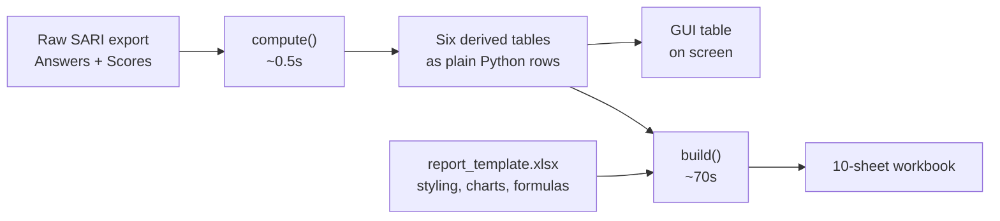
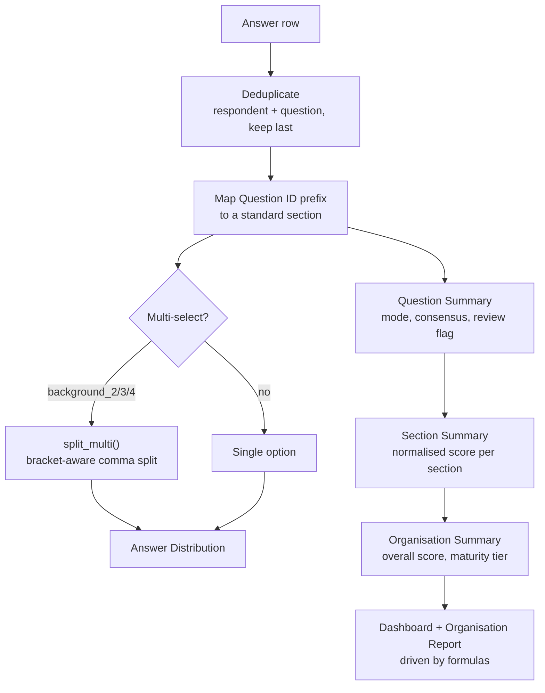
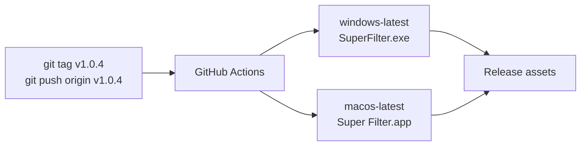

# Super Filter — SARI Organisation Statistics Generator

Reads a raw SARI survey export (`Answers` + `Scores` sheets) and produces a **10-sheet interactive workbook**: dashboard, per-organisation report, and section, question and answer-level breakdowns.

## Download

**Ready to run, no Python needed** — [**Releases**](https://github.com/dev-kir/temp_intern_filter/releases/latest)

| You use | Download | Then |
|---|---|---|
| Windows | `SuperFilter-windows.zip` | unzip the folder, run `SuperFilter.exe` |
| macOS | `SuperFilter-macos.zip` | unzip, right-click `Super Filter.app` → *Open* |

Unzip the **whole folder** before running — the executable needs its libraries and `report_template.xlsx` beside it.

> **First launch shows a warning.** The builds are unsigned, so Windows SmartScreen says "Windows protected your PC" (*More info* → *Run anyway*) and macOS Gatekeeper refuses a plain double-click (right-click → *Open*). Once each, then the system remembers. Removing it needs a paid code-signing certificate, and since March 2024 even an EV certificate no longer clears SmartScreen instantly — reputation still has to build over downloads. Not worth it for an internal tool. Running from source via `run_app.command` / `run_app.bat` avoids the warning entirely, because Python's own installer is already signed.

## How it works



Two stages, deliberately separate, so the table on screen and the sheet in the file can never disagree:

| | Cost | Does |
|---|---|---|
| `compute(input)` | ~0.5 s | reads the export and derives every table as plain Python rows |
| `build(input, template, output)` | ~70 s | writes those rows into `report_template.xlsx` |

The GUI calls `compute()` to draw the Organisation Summary and hands the **same result** to `build()` on export. Nothing is calculated twice.

`report_template.xlsx` owns all presentation — fonts, fills, column widths, page setup, the Dashboard chart, every formula and four Excel Tables. The script replaces data and repairs the organisation dropdowns and nothing else. **To change how the report looks, edit the template in Excel, not the Python.**

### What happens to one answer



> `split_multi()` is bracket-aware on purpose. A plain `split(",")` tears
> `"Shared infrastructure (e.g., cloud, computing power)"` into three phantom options,
> which silently undercounted a real answer across 39 organisations.

## Output sheets

| # | Sheet | Purpose |
|---|---|---|
| 1 | **Read Me** | Info & methodology |
| 2 | **Lists** | Organisation names (hidden, drives the dropdowns) |
| 3 | **Dashboard** | Organisation selector, KPI cards, section table, bar chart |
| 4 | **Organisation Report** | Printable per-org report with priority questions |
| 5 | **Organisation Summary** | One row per org — scores, maturity tier, agreement |
| 6 | **Section Summary** | Per org × section — avg/median/min/max/normalised |
| 7 | **Question Summary** | Per org × question — consensus, std dev, review flags |
| 8 | **Answer Distribution** | Per org × question × option — counts & % |
| 9 | **Raw Answers** | Raw data with standard section merged, email excluded |
| 10 | **Priority Detail** | Priority-ranked questions per org (hidden, drives formulas) |

Sheets 6 to 9 carry an Excel Table, whose range is re-pointed at the data on every run. Leaving those ranges stale, or adding a second sheet-level autofilter beside a Table's own, makes Excel open the file with *"we found a problem with some content"* and silently delete the Table.

## The desktop app

- **Drag and drop** an `.xlsx` onto the window, or click the drop zone to browse
- **Organisation dropdown** and free-text **search**
- **Sortable** on any column heading
- **Colour-coded Overall score** — green ≥ 75%, amber ≥ 50%, red below; every other column stays default text colour, matching the workbook
- **Resizable** — widening the window widens the columns; narrower than the minimum scrolls sideways
- **Export** runs on a background thread with progress, so the window stays responsive through the 70 seconds

The table shows the 11 columns worth scanning. The other seven — Departments represented, Role levels represented, Latest submission, Average consensus, Questions for review, Interpretation, Distance to next tier — are in the exported workbook.

## Maturity tiers

| Overall score | Tier |
|---|---|
| 0.0 – 0.2 | AI Aware - 0 |
| 0.2 – 0.4 | AI Explorer - 1 |
| 0.4 – 0.6 | AI Follower - 2 |
| 0.6 – 0.8 | AI Leader - 3 |
| 0.8 – 1.0 | AI Pioneer - 4 |

## BM→EN section merge

Bahasa Malaysia sections map to English by Question ID prefix:

| BM section | → | EN section |
|---|---|---|
| Latar Belakang | → | Background |
| Strategi & Kepimpinan | → | Strategy & Leadership |
| Bakat & Budaya Organisasi | → | Talent & Organisational Culture |
| Pengurusan Data & Kesiapsiagaan | → | Data Management & Readiness |
| Infrastruktur & Teknologi | → | Infrastructure & Technology |
| Tadbir Urus, Dasar & Etika | → | Governance, Policy & Ethics |
| Pelaburan | → | Investment |
| Pelaksanaan AI & Impak | → | AI Implementation & Potential Impact |

## Running from source

**Without a terminal** — double-click `run_app.command` (macOS) or `run_app.bat` (Windows). The first run builds its own environment in about a minute; later runs open straight away. Python 3 must be installed once, from [python.org](https://python.org).

With a terminal:

```bash
python3 -m venv venv
source venv/bin/activate         # macOS / Linux
# venv\Scripts\activate          # Windows
pip install -r requirements.txt

python app.py                                # GUI
python super_filter.py INPUT.xlsx -o OUT.xlsx   # CLI
```

## Building the apps



**PyInstaller cannot cross-compile.** A Mac produces only a `.app`, a Windows machine only a `.exe`. `.github/workflows/build.yml` builds each on its own runner from the same `app.py` and attaches both to the Release. The workflow **fails** if `report_template.xlsx` is missing from the bundle, because that omission builds and launches cleanly and only surfaces when a user clicks Export.

Building by hand, on the platform you are targeting:

```bash
pip install -r requirements.txt pyinstaller
pyinstaller app.spec --noconfirm
```

Icons come from `assets/icon.svg`. After editing it, run `./make_icons.sh` to regenerate the `.png`, `.ico` and `.icns` — every size is rendered from the vector, not downscaled, so 16px and 32px stay legible. Needs `librsvg` (`brew install librsvg`).

## Requirements

- Python 3.8+
- `openpyxl` — reads and writes the workbooks
- `tkinterdnd2` — drag-and-drop; **optional**, the app falls back to click-to-browse

pandas is not used.

## Project structure

```
ammar_super_filter/
├── app.py                  GUI — the table, filters, export
├── super_filter.py         compute() + build() — all the logic
├── app.spec                PyInstaller recipe, both platforms
├── make_icons.sh           assets/icon.svg -> .png / .ico / .icns
├── run_app.command         macOS double-click launcher
├── run_app.bat             Windows double-click launcher
├── report_template.xlsx    presentation layer — styling, charts, formulas
├── requirements.txt
├── assets/
│   └── icon.svg .png .ico .icns
├── docs/
│   ├── ALGORITHM.md        full step-by-step algorithm
│   └── BRIEF.md            original design brief
└── .github/workflows/
    └── build.yml           builds and releases both platforms on a v* tag
```

Survey exports, generated workbooks and build output are **not** committed. Exports contain respondent names and job titles, and the built apps are 13–60 MB — those belong in Releases.
