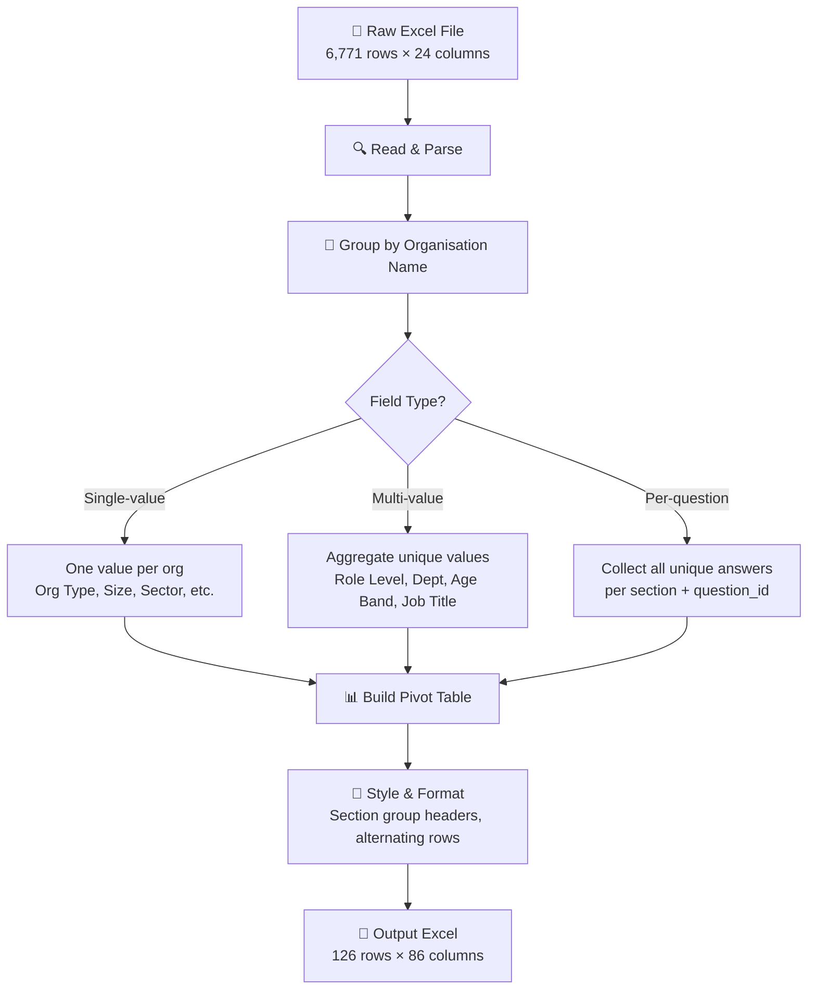

# Super Filter — SARI Survey Results Processor

A Python script that reads the raw SARI survey Excel export and produces **3 sheets**:

| Sheet | Purpose |
|---|---|
| **Pivot** | One row per org, 74 question columns — see what each org answered |
| **Scorecard** | One row per org, per-section average scores + **OVERALL** — measure performance |
| **Question Reference** | Maps question IDs to full question text |

- **Each row = one organisation** (126 rows, no duplicates)
- When multiple participants give different answers, they are joined with ` | `
- Scorecard has **color scale** (red→yellow→green) for quick visual comparison

## Setup & Run

### First time (on any laptop)

```bash
# 1. Create virtual environment
python3 -m venv venv

# 2. Activate it
source venv/bin/activate        # macOS / Linux
# venv\Scripts\activate         # Windows

# 3. Install dependencies
pip install -r requirements.txt

# 4. Run the script
python super_filter.py
```

### Subsequent runs

```bash
source venv/bin/activate        # activate the venv
python super_filter.py          # run
```

The output file `SARI_Results_Processed.xlsx` will appear in the same folder.

## Output Structure

The output Excel has **three sheets**:

### Sheet 1: `Pivot` — Text answers (what each org said)

| Row | Content |
|---|---|
| Row 1 | **Section group headers** (merged cells, e.g. "Background", "Strategy & Leadership") |
| Row 2 | **Column headers** — org-level fields + question IDs |
| Row 3+ | **Data** — one row per organisation |

**Left side (12 columns):** Organisation-level info
- Organisation Name, Parent Company, Organisation Type, Organisation Size, Stakeholder Category, PDCS Sector, District, Part of Group
- Role Level, Department, Age Band, Job Title (aggregated with ` | `)

**Right side (74 columns):** One column per question, grouped by section
- Each cell shows all unique answers from that org's participants, joined with ` | `

### Sheet 2: `Scorecard` — Numerical scores (measure performance)

This is the sheet to use for **evaluating whole-company performance**.

| Column | Description |
|---|---|
| Organisation Name ... Job Title | Same org-level info as Pivot |
| Strategy & Leadership | Average score for Strategy section (0–4) |
| Talent & Organisational Culture | Average score for Talent section (0–4) |
| Data Management & Readiness | Average score for Data section (0–4) |
| Infrastructure & Technology | Average score for Infrastructure section (0–4) |
| Governance, Policy & Ethics | Average score for Governance section (0–4) |
| Investment | Average score for Investment section (0–4) |
| AI Implementation & Potential Impact | Average score for AI Impact section (0–4) |
| **OVERALL** | Average across all 7 scored sections — **the single number to rank orgs** |

#### Scoring Formula

```
For each question:
  - Each participant's answer has a score (0–4, where 4 = best)
  - If multiple participants answered the same question, their scores are averaged

For each section:
  Section Score = SUM(question_averages) / COUNT(questions_in_section)

For the OVERALL:
  OVERALL = SUM(all_participant_scores) / COUNT(all_participant_scores)
```

**Note:** `background_1` through `background_4` are **demographic questions** (not performance-scored). All their scores are 0 in the raw data, so they are excluded from the Scorecard. Only 7 sections with real 0–4 scoring are included.

- Scores are **0–4 scale** (higher = better AI maturity)
- Cells have **color scale**: red (low) → yellow (mid) → green (high)
- Sort by the OVERALL column to rank organisations from best to worst
- Empty cells = no participant from that org answered any question in that section

### Sheet 3: `Question Reference` — Maps question IDs to full question text

| Column | Description |
|---|---|
| Section | Which section the question belongs to |
| Question ID | Short code (e.g. `background_1`) |
| Question # | Order within the section |
| Question Text | Full question wording |

## How to Verify & Validate the Output

### 1. Row count
The output should have exactly **126 data rows** (one per organisation). Row 1 = section headers, Row 2 = column headers, Rows 3–128 = data.

### 2. Each org appears exactly once
Scroll through column A — every organisation name should appear only once. No duplicates.

### 3. Multi-value fields are aggregated
Columns like **Role Level**, **Department**, **Age Band**, **Job Title** should show all unique values joined with ` | `.

### 4. Multi-participant answers are preserved
When multiple people from the same org answer the same question differently, all unique answers appear in that cell joined with ` | `. For example, BDC's `background_1` cell shows 5 different answers.

### 5. Column exclusion works
Open `super_filter.py`, comment out any line in the `OUTPUT_COLUMNS` list (add `#` at the start), re-run, and verify that column is gone from the output.

### 6. Quick sanity check (Python one-liner)
```bash
source venv/bin/activate
python3 -c "
import openpyxl
wb = openpyxl.load_workbook('SARI_Results_Processed.xlsx')
ws = wb.active
print('Data rows:', ws.max_row - 2)
# Check no duplicate orgs
orgs = set()
for r in range(3, ws.max_row + 1):
    name = ws.cell(r, 1).value
    if name in orgs:
        print(f'DUPLICATE: {name}')
    orgs.add(name)
print(f'Unique orgs: {len(orgs)}')
print(f'Question columns: {ws.max_column - 12}')
"
```

## How It Works



### Column Processing Logic

| Aggregator | Behaviour | Example Columns |
|---|---|---|
| `single` | One value per org (all rows should match) | Organisation Type, Size, Sector, District |
| `list` | All unique values joined with `\|` | Role Level, Department, Age Band, Job Title |
| Question columns | All unique answers per (section, question_id) joined with `\|` | background_1, strategy_1, etc. |

### Multi-Participant Handling

When multiple people from the same organisation answer the same question differently, **all unique answers are joined with ` | `** in that cell. This lets you see the full spread of responses at a glance.

## Configuration

Open `super_filter.py` and edit the **CONFIG** section at the top:

```python
# Change input/output file names
INPUT_FILE = "SARI_Results_2026-08-05-01-54-15.xlsx"
OUTPUT_FILE = "SARI_Results_Processed.xlsx"

# What to display in Pivot question cells: "answer", "answer_value", or "answer_score"
QUESTION_CELL_CONTENT = "answer"

# To EXCLUDE an org-level column, comment it out with #
OUTPUT_COLUMNS = [
    ("Organisation Name",     "organisation_name",   "single"),
    # ("Parent Company",      "parent_company",      "single"),  # ← excluded!
    ("Organisation Type",     "organisation_type",   "single"),
    ...
]

# To EXCLUDE a section from the Scorecard, comment it out
SCORECARD_SECTIONS = [
    "Background",
    "Strategy & Leadership",
    # "Investment",           # ← excluded from scorecard!
    ...
]
```

## Data Summary

- **126** unique organisations → **126** rows in output
- **16** sections (8 English + 8 Bahasa Malaysia)
- **74** unique (section, question_id) combinations → **74** question columns in Pivot
- **7** scored sections in Scorecard (Background excluded — demographic only)
- **33** scored questions (0–4 scale), **4** demographic questions (background, score=0)
- **6,771** raw rows processed
- **1–17** participants per organisation

## Requirements

- Python 3.8+
- openpyxl (`pip install openpyxl`)

## Project Structure

```
ammar_super_filter/
├── super_filter.py                          # Main processing script
├── requirements.txt                         # Python dependencies (pinned versions)
├── README.md                                # This file
├── Super_Filter.md                          # Original design brief
├── .gitignore                               # Ignore venv, cache, output files
├── venv/                                    # Virtual environment (not in git)
├── SARI_Results_2026-08-05-01-54-15.xlsx    # Input file (raw survey export)
└── SARI_Results_Processed.xlsx              # Output file (generated, not in git)
```

## Future Roadmap

- [ ] GUI application with drag-and-drop Excel upload
- [ ] Interactive column toggling and filtering
- [ ] Pivot table / chart generation
- [ ] Export to PDF report
