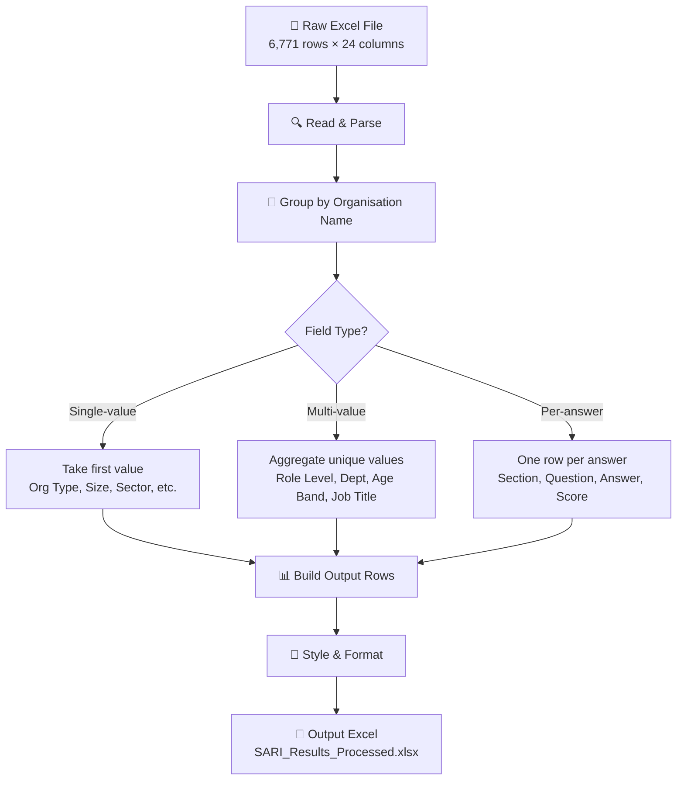

# Super Filter — SARI Survey Results Processor

A Python script that reads the raw SARI survey Excel export and produces a clean, grouped output where each row represents one **organisation × section × question × answer**.

## Quick Start

```bash
# 1. Install dependencies
pip install -r requirements.txt

# 2. Place your Excel file in the same folder (or update INPUT_FILE in the script)

# 3. Run
python super_filter.py
```

The output file `SARI_Results_Processed.xlsx` will appear in the same folder.

## How It Works



### Column Processing Logic

| Aggregator | Behaviour | Example Columns |
|---|---|---|
| `single` | One value per org (all rows should match) | Organisation Type, Size, Sector, District |
| `list` | All unique values joined with `\|` | Role Level, Department, Age Band, Job Title |
| `per_answer` | One row per unique answer | Section, Question ID, Question, Answer, Answer Score |

### Multi-Participant Handling

When multiple people from the same organisation answer the same question differently, **each unique answer gets its own row**. This means you'll see the same org + section + question repeated with different answers — this is intentional so you can see the spread of responses.

## Configuration

Open `super_filter.py` and edit the **CONFIG** section at the top:

```python
# Change input/output file names
INPUT_FILE = "SARI_Results_2026-08-05-01-54-15.xlsx"
OUTPUT_FILE = "SARI_Results_Processed.xlsx"

# To EXCLUDE a column, comment it out with #
OUTPUT_COLUMNS = [
    ("Organisation Name",     "organisation_name",   "single"),
    # ("Parent Company",      "parent_company",      "single"),  # ← excluded!
    ("Organisation Type",     "organisation_type",   "single"),
    ...
]
```

## Output Columns (Default)

| # | Column | Type |
|---|---|---|
| 1 | Organisation Name | Single |
| 2 | Parent Company | Single |
| 3 | Organisation Type | Single |
| 4 | Organisation Size | Single |
| 5 | Stakeholder Category | Single |
| 6 | PDCS Sector | Single |
| 7 | District | Single |
| 8 | Part of Group | Single |
| 9 | Role Level | List (aggregated) |
| 10 | Department | List (aggregated) |
| 11 | Age Band | List (aggregated) |
| 12 | Job Title | List (aggregated) |
| 13 | Section | Per-answer |
| 14 | Question ID | Per-answer |
| 15 | Question | Per-answer |
| 16 | Answer | Per-answer |
| 17 | Answer Value | Per-answer |
| 18 | Answer Score | Per-answer |

## Data Summary

- **126** unique organisations
- **16** sections (8 English + 8 Bahasa Malaysia)
- **74** unique questions
- **6,771** raw rows → **6,771** output rows
- **1–17** participants per organisation

## Requirements

- Python 3.8+
- openpyxl (`pip install openpyxl`)

## Project Structure

```
ammar_super_filter/
├── super_filter.py                          # Main processing script
├── requirements.txt                         # Python dependencies
├── README.md                                # This file
├── Super_Filter.md                          # Original design brief
├── SARI_Results_2026-08-05-01-54-15.xlsx    # Input file (raw survey export)
└── SARI_Results_Processed.xlsx              # Output file (generated)
```

## Future Roadmap

- [ ] GUI application with drag-and-drop Excel upload
- [ ] Interactive column toggling and filtering
- [ ] Pivot table / chart generation
- [ ] Export to PDF report
